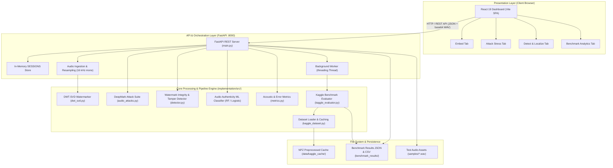
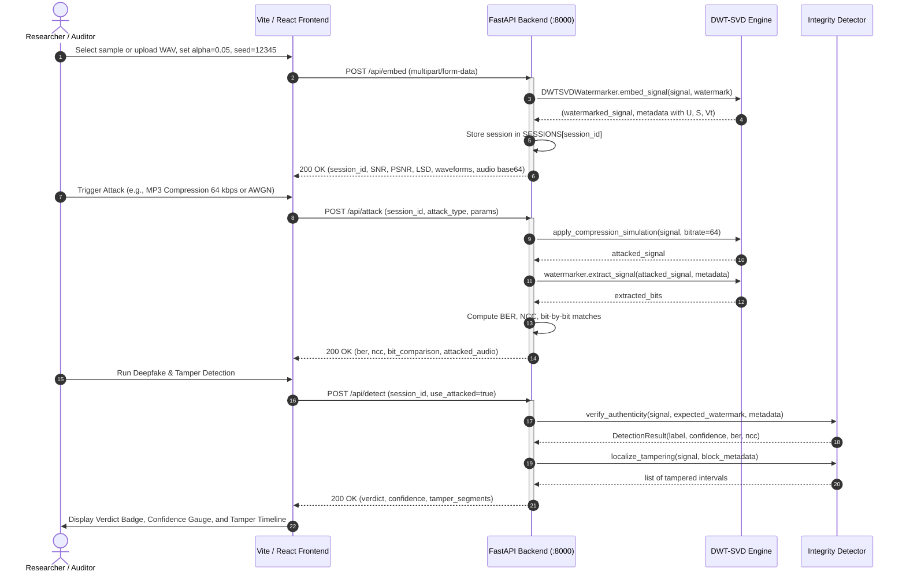

# System Architecture — Audio Watermarking & AI Deepfake Detection Testbed

## 1. Overview

This system is an academic and production-ready signal processing testbed designed for proactive AI speech authenticity verification, intellectual property protection, and temporal tamper localization. Rather than relying solely on post-hoc passive classifiers that degrade on out-of-distribution synthetic speech, the system embeds imperceptible binary watermark sequences into the singular values of the 3-level Discrete Wavelet Transform (DWT-SVD) approximation sub-band. The platform serves academic researchers, AI safety auditors, and media broadcasters with a full-stack architecture comprising a high-performance Python signal processing core, a FastAPI asynchronous backend, and a modern Vite/React analytical dashboard.

---

## 2. High-Level Architecture

The system is partitioned into three discrete layers:
1. **Presentation Layer**: React (Vite) single-page application rendering SVG waveforms, interactive bit maps, and real-time tamper timelines.
2. **API & Orchestration Layer**: FastAPI asynchronous REST service managing session caching, background benchmark execution, and request ingestion.
3. **Core Signal Processing Engine**: Algorithmic engine executing wavelet decomposition, singular value modulation, channel degradation attacks, and statistical detection metrics.

---

## 3. Pipeline Dataflow Diagram

The pipeline traces the end-to-end transformation of speech audio through ingestion, orthonormal embedding, channel simulation, and cryptographic verification.

```mermaid
flowchart LR
    subgraph Ingestion["1. Ingestion"]
        InRaw["Audio Input (WAV/MP3 or Synthetic Generator)"] --> Resample["Resample to 16 kHz Mono & Normalize (-1.0 to 1.0)"]
    end

    subgraph Embedding["2. DWT-SVD Embedding"]
        Resample --> DWTDec["3-Level DWT (pywt.wavedec, 'db4' or 'haar')"]
        DWTDec --> SVDDecomp["Reshape Approximation Subband cA3 to Square Matrix + SVD"]
        SVDDecomp --> SVDMod["Singular Value Modulation (S' = S + alpha * w)"]
        SVDMod --> IDWTRec["Matrix Reassembly + Inverse DWT Reconstruction"]
    end

    subgraph Distortion["3. Channel & Tamper Simulation"]
        IDWTRec --> AttSuite["DeepMark Attack Suite (AWGN, MP3, Filters, Crop, Vocoder)"]
    end

    subgraph Extraction["4. Verification & Localization"]
        AttSuite --> ExtEngine["DWT Decomposition on Attacked Signal"]
        ExtEngine --> OrthoProj["Orthonormal Projection: S_proj = diag(U_T * A' * V)"]
        OrthoProj --> BitExtract["Bit Recovery: sign((S_proj - S) / alpha)"]
        BitExtract --> Decision["Confidence & Tamper Scoring (BER, NCC, Segment Checks)"]
    end

    subgraph Output["5. Output Verdict"]
        Decision --> Auth["Authentic (BER <= 0.15)"]
        Decision --> Tamp["Tampered (0.15 < BER <= 0.35)"]
        Decision --> Spoof["AI Deepfake / Unwatermarked (BER > 0.35)"]
    end
```

---

## 4. Sequence Diagram: Primary Interactive Use Case

The primary interaction lifecycle involves embedding a watermark, subjecting it to channel distortion, and authenticating the audio payload.

---

## 5. Module Breakdown

| Module / File | Responsibility | Key Classes / Functions | Upstream & Downstream Dependencies |
| :--- | :--- | :--- | :--- |
| [`api/main.py`](file:///e:/Rohith/COLLEGE/Minor%20Mini%20Project/minor_project_s6/api/main.py) | REST API entry point, session management, file ingestion, benchmark thread dispatch | `embed_watermark`, `attack_watermark`, `detect_authenticity`, `trigger_benchmark`, `_execute_benchmark_worker` | `fastapi`, `numpy`, `soundfile`, `librosa`, imports all `implementation/src` modules |
| [`implementation/src/embedding/dwt_svd.py`](file:///e:/Rohith/COLLEGE/Minor%20Mini%20Project/minor_project_s6/implementation/src/embedding/dwt_svd.py) | Core watermarking algorithmic engine | `DWTSVDWatermarker`, `embed_signal`, `extract_signal`, `embed_blocks`, `extract_blocks`, `generate_watermark` | `pywt`, `numpy`, `librosa`, `soundfile` |
| [`implementation/src/attacks/audio_attacks.py`](file:///e:/Rohith/COLLEGE/Minor%20Mini%20Project/minor_project_s6/implementation/src/attacks/audio_attacks.py) | DeepMark-aligned digital signal degradation simulations | `AttackSuite`, `add_awgn_noise`, `apply_lowpass_filter`, `apply_resampling_attack`, `apply_compression_simulation`, `apply_resynthesis_attack` | `scipy.signal`, `numpy` |
| [`implementation/src/detection/detector.py`](file:///e:/Rohith/COLLEGE/Minor%20Mini%20Project/minor_project_s6/implementation/src/detection/detector.py) | Authenticity adjudication, tamper localization, and supervised ML classification | `WatermarkIntegrityDetector`, `AudioAuthenticityClassifier`, `DetectionResult` | `sklearn.ensemble.RandomForestClassifier`, `pywt`, `metrics.py`, `dwt_svd.py` |
| [`implementation/src/evaluation/metrics.py`](file:///e:/Rohith/COLLEGE/Minor%20Mini%20Project/minor_project_s6/implementation/src/evaluation/metrics.py) | Mathematical evaluation of fidelity, watermark recovery, and classification metrics | `calculate_snr`, `calculate_psnr`, `calculate_seg_snr`, `calculate_lsd`, `calculate_ber`, `calculate_ncc`, `calculate_roc_and_auc`, `calculate_eer` | `numpy`, `scipy`, `sklearn.metrics` |
| [`implementation/src/data/kaggle_dataset.py`](file:///e:/Rohith/COLLEGE/Minor%20Mini%20Project/minor_project_s6/implementation/src/data/kaggle_dataset.py) | Real-world Kaggle dataset loader, speaker-disjoint splitting, and NPZ disk caching | `KaggleDatasetLoader`, `KaggleAudioSample`, `load_subsampled_dataset`, `split_by_speaker` | `soundfile`, `librosa`, `numpy`, `tqdm` |
| [`implementation/src/pipeline/kaggle_evaluator.py`](file:///e:/Rohith/COLLEGE/Minor%20Mini%20Project/minor_project_s6/implementation/src/pipeline/kaggle_evaluator.py) | Empirical evaluation runner across 200 real clips and 14 attack conditions | `KaggleBenchmarkEvaluator`, `run_full_evaluation` | `matplotlib`, `sklearn`, `dwt_svd.py`, `audio_attacks.py`, `kaggle_dataset.py` |
| [`implementation/src/pipeline/benchmark_runner.py`](file:///e:/Rohith/COLLEGE/Minor%20Mini%20Project/minor_project_s6/implementation/src/pipeline/benchmark_runner.py) | Synthetic benchmark test orchestrator | `BenchmarkRunner`, `run_comprehensive_benchmark` | `dataset_manager.py`, `metrics.py`, `audio_attacks.py` |
| [`implementation/src/pipeline/plot_empirical_results.py`](file:///e:/Rohith/COLLEGE/Minor%20Mini%20Project/minor_project_s6/implementation/src/pipeline/plot_empirical_results.py) | Publication-grade 300 DPI multi-panel figure generator | `EmpiricalResultsPlotter`, `generate_presentation_metrics_figure` | `matplotlib.pyplot`, `json` |
| [`frontend/src/App.jsx`](file:///e:/Rohith/COLLEGE/Minor%20Mini%20Project/minor_project_s6/frontend/src/App.jsx) | React client application shell, theme management, and global session binding | `App` | `lucide-react`, React tabs |
| [`run_pipeline.py`](file:///e:/Rohith/COLLEGE/Minor%20Mini%20Project/minor_project_s6/run_pipeline.py) | Unified command-line interface for demo, benchmarks, and multi-server execution | `run_demo`, `run_benchmark`, `run_kaggle`, `run_serve` | `subprocess`, `argparse`, `sys` |

---

## 6. Data and State Management

- **Transient In-Memory Sessions**:
  Stored in `api/main.py:SESSIONS` dictionary keyed by UUID4. Holds raw float32 arrays (`original_signal`, `watermarked_signal`, `attacked_signal`), singular value vectors (`metadata`), block partition layouts, and PRNG seeds. **Note**: In-memory state is non-persistent and will reset across server restarts.
- **Preprocessing Cache**:
  Stored in `data/kaggle_cache/` as compressed `.npz` archives paired with `_meta.json` manifests. Contains speaker IDs, recording chunk indices, and normalized audio arrays to eliminate audio resampling and disk I/O on repeated benchmark runs.
- **Benchmark Artifacts**:
  Persisted in `benchmark_results/` as structured JSON summaries (`benchmark_results.json`, `kaggle_results.json`) and tabular CSV files (`kaggle_robustness.csv`, `kaggle_fidelity.csv`, `kaggle_detection.csv`).
- **Static Test Samples**:
  Stored in `samples/` as 16 kHz PCM_16 WAV files (`clean_speech_sample1.wav`, `clean_speech_sample2.wav`, `unwatermarked_deepfake.wav`).

---

## 7. Configuration and Deployment

- **Python Environment**:
  Configured via [`pyproject.toml`](file:///e:/Rohith/COLLEGE/Minor%20Mini%20Project/minor_project_s6/pyproject.toml) and managed with `uv`. Dependencies pinned via [`uv.lock`](file:///e:/Rohith/COLLEGE/Minor%20Mini%20Project/minor_project_s6/uv.lock).
- **Node.js Environment**:
  Configured via [`frontend/package.json`](file:///e:/Rohith/COLLEGE/Minor%20Mini%20Project/minor_project_s6/frontend/package.json), bundled using Vite, styled via custom CSS tokens in `index.css`.
- **Execution Modes**:
  - Full-stack concurrent dev server: `uv run python run_pipeline.py --serve` (spawns Uvicorn on port 8000 and Vite on port 5173).
  - Standalone API: `uv run python run_pipeline.py --api`
  - Standalone Frontend: `uv run python run_pipeline.py --frontend`
  - Offline Academic Demo: `uv run python run_pipeline.py --demo`
  - Kaggle Evaluation Suite: `uv run python run_pipeline.py --kaggle --n-per-class 100`

---

## 8. Current System Status

- **Working**:
  - 3-level DWT-SVD orthonormal projection watermarking with 0.0000 clean BER.
  - Full DeepMark 14-attack simulation suite.
  - Dual-mode authenticity detector (heuristic BER thresholding + supervised Random Forest multi-feature model).
  - Block-based temporal tamper localization down to frame granularity (4096 samples).
  - Kaggle dataset preprocessor with stratified, speaker-disjoint splitting.
  - Complete FastAPI backend with full CORS support and base64 audio streaming.
  - Interactive React 19 frontend with real-time waveform visualization, bit matrix inspection, and tamper localization timelines.
  - 22 passing automated tests in `tests/`.
- **Partial**:
  - Benchmark thread orchestration: Background benchmark relies on an in-memory `threading.Thread` and a single global state dictionary (`BENCHMARK_STATUS`), which lacks job cancellation, persistence, and concurrency isolation.
  - Semi-blind QIM extraction: QIM mode is implemented but has lower robustness to aggressive scaling compared to the non-blind orthonormal projection.
- **Missing**:
  - Persistent database/cache (Redis / SQLite) for session state.
  - Asynchronous background task queue (Celery / RQ) for long-running benchmarks.
  - User authentication and API key rate limiting.
  - Containerization manifests (`Dockerfile`, `docker-compose.yml`) and automated CI/CD pipelines (`.github/workflows`).

---

## 9. Recommendations & Architectural Audit

### Architecture & Design
1. **In-Memory Session Store Leak Risk (`api/main.py:SESSIONS`)**:
   `SESSIONS` stores large float32 arrays and uncompressed audio buffers in a Python dictionary with no eviction policy (TTL/LRU) or storage cap. Over prolonged usage with numerous file uploads, this will lead to unbounded memory growth and eventually crash the process with an Out-Of-Memory (OOM) error.
   *Fix*: Implement a bounded `cachetools.TTLCache(maxsize=100, ttl=1800)` or persist session arrays to a temporary disk directory with automatic cleanup.
2. **Benchmark State Thread Safety (`api/main.py:_execute_benchmark_worker`)**:
   The background benchmark execution uses an unmanaged background daemon thread mutating a single global mutable dictionary (`BENCHMARK_STATUS`) without locks (`threading.Lock`). Multiple concurrent trigger calls can cause race conditions or corrupt progress counters.
   *Fix*: Adopt a task UUID pattern, a thread-safe dictionary guarded by `threading.Lock`, or offload execution to a lightweight job runner.
3. **Redundant Top-Level `src/` Folder**:
   The repository contains both `implementation/src/` (the true source tree) and a top-level `src/` containing shim proxy scripts (`src/data/kaggle_dataset.py`, `src/pipeline/kaggle_evaluator.py`). This dual-path structure causes import confusion and non-standard `sys.path` patching across multiple files.
   *Fix*: Consolidate all core logic under a single canonical package namespace and install it in editable mode (`uv pip install -e .`).

### Code Quality & Maintainability
1. **Repeated Dynamic `sys.path` Injections**:
   Nearly every script (`api/main.py`, `run_pipeline.py`, `tests/test_api.py`, `implementation/src/pipeline/kaggle_evaluator.py`) manually calculates `BASE_DIR` and injects paths into `sys.path`. This is fragile and prone to breaking when scripts are called from different current working directories.
   *Fix*: Declare `packages = ["implementation/src"]` in `pyproject.toml` or standardize package layout so that `uv run` handles module resolution natively.
2. **Hardcoded API URLs in Frontend (`frontend/src/App.jsx`)**:
   `const API_BASE = 'http://localhost:8000';` is hardcoded directly in `App.jsx`. Deploying the frontend to a staging or production domain requires manual source edits.
   *Fix*: Use Vite environment variables (`import.meta.env.VITE_API_BASE || 'http://localhost:8000'`) and provide a `.env.example`.

### Reliability, Safety & Input Validation
1. **Unbounded Audio Uploads**:
   The `/api/embed`, `/api/attack`, and `/api/detect` endpoints read arbitrary uploaded file buffers directly into memory (`await file.read()`). An attacker or user uploading an uncompressed multi-gigabyte audio file could exhaust server RAM.
   *Fix*: Enforce an upload file size ceiling (e.g., max 25 MB) and maximum audio duration check (e.g., 60 seconds) in FastAPI before parsing with `soundfile`.
2. **Fallback Audio Loader Redundancy**:
   `_load_audio_bytes` catches general `Exception` on `sf.read` and falls back to `librosa.load(buffer)`. If an invalid file format or corrupted binary is passed, `librosa` will also fail, but without a clear diagnostic HTTP 422/400 error message.

### Security
1. **Local Kaggle API Credentials (`kaggle/kaggle.json`)**:
   A raw Kaggle credential file exists locally at `kaggle/kaggle.json`. While it is correctly ignored by `.gitignore` (`.gitignore:22:/kaggle/`), relying on directory-level ignore patterns is risky.
   *Fix*: Remove local credential files from the repository directory entirely and instruct developers to use environment variables (`KAGGLE_USERNAME`, `KAGGLE_KEY`) or the default `~/.kaggle/kaggle.json` path.
2. **Wildcard CORS Configuration (`api/main.py:65`)**:
   `CORSMiddleware` allows `allow_origins=["*"]` alongside `allow_credentials=True`. Modern browsers reject wildcard origins when credentials are included, which can cause subtle runtime cross-origin errors in certain environments.
   *Fix*: Restrict `allow_origins` to explicitly permitted domains in development and production environments.

### Testing & Observability
1. **Absence of Frontend Automated Tests**:
   The frontend contains zero unit tests or end-to-end component tests (no Vitest / React Testing Library configuration).
   *Fix*: Add basic Vitest component unit tests for `WaveformViewer.jsx`, `BitMapViewer.jsx`, and `TamperTimeline.jsx`.
2. **Lack of Structured Logging**:
   The backend relies heavily on `print(...)` statements instead of Python's standard `logging` module. In production environments, log levels, timestamps, and request trace IDs will be lost.
   *Fix*: Replace `print` with Python `logging.getLogger("watermarking")`.

---

## 10. Prioritized Roadmap

| Priority | Task | Effort | Rationale |
| :---: | :--- | :---: | :--- |
| **P0** | Add TTL/LRU eviction and bounded capacity to `SESSIONS` cache | S | Prevents server Out-Of-Memory crashes under repeated file uploads. |
| **P0** | Enforce file size (<25MB) and audio duration limits on upload endpoints | S | Defends backend against resource exhaustion from oversized audio files. |
| **P1** | Replace hardcoded `API_BASE` in frontend with `import.meta.env.VITE_API_BASE` | S | Enables deployment across diverse hosting environments without code edits. |
| **P1** | Add Dockerfile and docker-compose.yml for containerized one-step deployment | M | Standardizes system setup across different developer and evaluation environments. |
| **P1** | Implement CI/CD pipeline via GitHub Actions for automated linting & pytest | S | Guarantees test suite execution and quality gates on pull requests. |
| **P2** | Consolidate top-level `src/` shims and remove manual `sys.path` hacks | M | Restores clean Python packaging conventions and improves developer experience. |
| **P2** | Add Vitest frontend component tests for waveform and tamper timeline viewers | M | Prevents UI regressions during future visualization enhancements. |
| **P2** | Integrate cryptographic multi-key payloads (HMAC / timestamp signatures) | L | Extends academic watermarking into real-world tamper-proof copyright attribution. |
